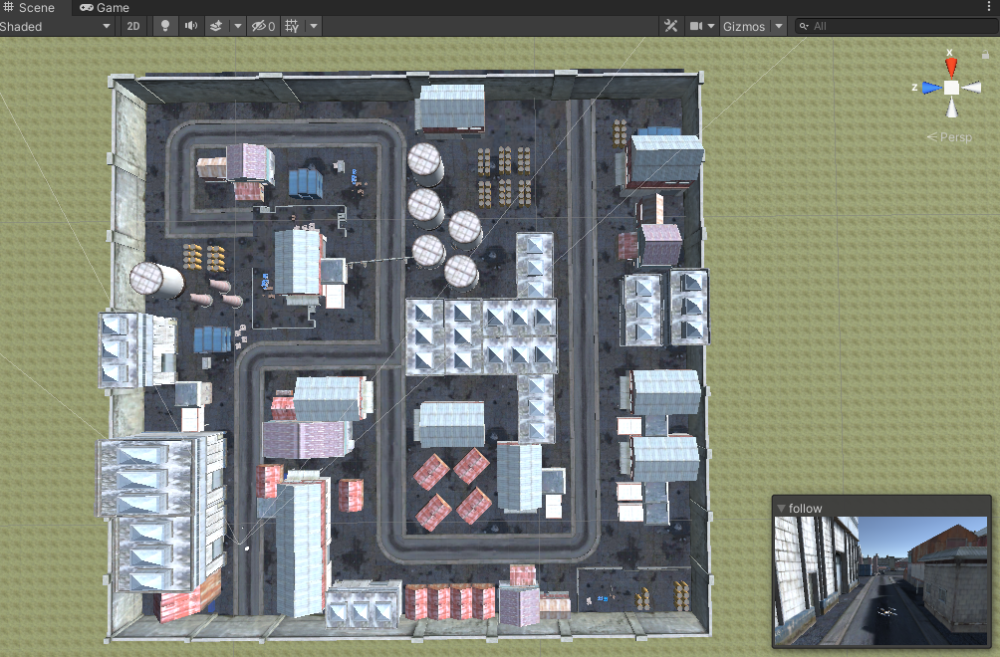
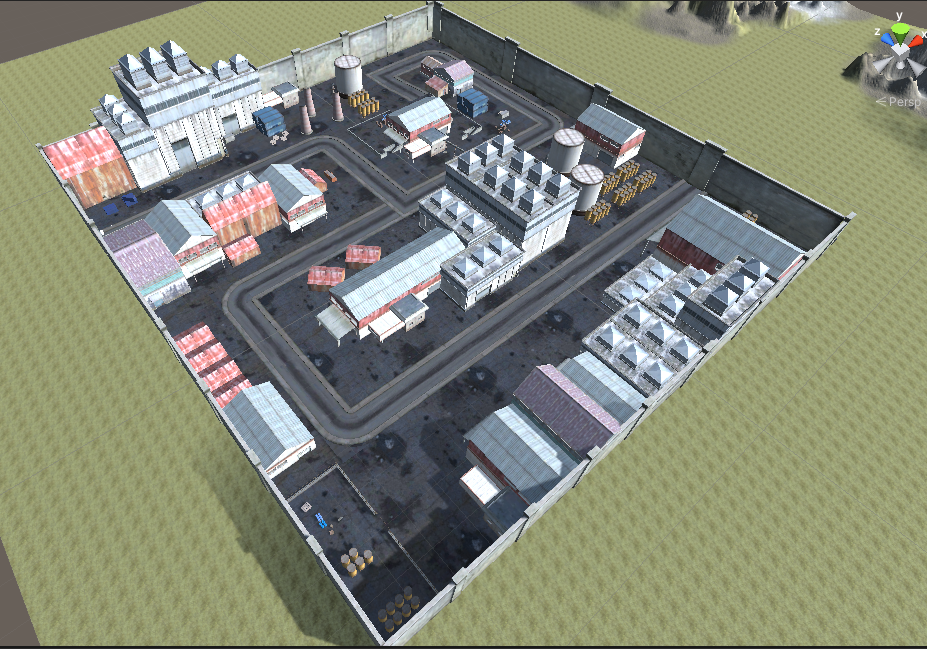
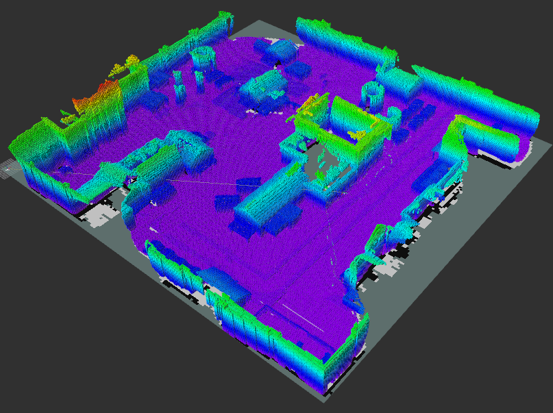

# autsys-projects-kkfly
Welcome to our project of Sim & Mapping, you will find how a UAV is able to explore a enclosed and static unknown environment autonomously.
- Institute: Professur für Autonomous Aerial Systems by Prof. Dr. Markus Ryll
- Technical University of Munich
- Course: Autonomous Systems 0000005659
- please go to `catkin_ws/` for launch instructions!
## Table of contents
1. [Task description](#intro)
2. [Assignment of task](#deliverables)
3. [Task Details](#setup)
4. [Dependent packages](#dep)
5. [Milestones](#miles)
6. [Result](#result)
   1. [Quicklink to Final Report](#report)
   2. [Quicklink to Final Presentation](#presentation)
   3. [Quicklink to Final Video and Images](#videos)

### 1. Advanced Challenge 1 – Sim & Mapping 
Use a mapping approach fo your choice to navigate an unknown
environment
- create realistic Unity environment (i.e. city, harbour, indutrial, … [200x200m])
- process pointcloud into voxel-grid
- generate a local trajectory in known space (2D) in a receeding horizon fashion
- map the environment

### 2.Assignment of tasks 
#### Shengkai Huang
Simulation: Create realistic Unity environment
#### Yu-Chen Chou
Process pointcloud into voxel-grid and map the enviroment
#### Hung-Yueh Liao
Orientation and movement control of the drone
#### Yu Li
Path planning and trajectory generation: 
Find the goals and a collision-free safe path in known space (2D) by Dijkstra Algorithm, generate a local 6D trajectory (4DoF) 
Create container with Docker

### 3.Task Details 
#### 1. Create realistic environment,
- create an unity environment 

Scene map size : [180 x 180] 
Components of scene : roads, houses of various shapes, containers, oil tanks, industrial pipes, etc. 
The unity environment is downloaded when running catkin build. To change the unity environment, simply change the Dropbox link in CMakeLists.txt of the simulation package. 
- The following Unity environment is available for this project: 
 https://www.dropbox.com/s/uqv7zuq1uqzmnhn/FPSdemo1.zip?dl=0
#### 2. Process pointcloud into voxel-grid,
- create computer vision package:  
	the generated grid map should correctly and statically recover the orientation deviation from the unit coordinate to the ROS simulation coordinate and possibly without overlapping with the previous coordinate frame,
- create a mapping package to grid map:
    it has the functionality to generate the voxel-based map
#### 3. Provide 2 coordinates for start and destination in the known arena, navigate through unknown obstacles in a receding horizon fashion,
- obstacle based navigation path planning:
	1. fly an 'N' pattern trajectory on the x-y plane
	2. fly over the obstacle depending on sensor data and add some constraints to avoid collisions
	3. design such a motion mode that improves the mapping/structure reconstruction goal
	
### 4. Dependent packages 
	-  depth_image_proc (source: https://github.com/ros-perception/image_pipeline/tree/melodic/depth_image_proc)
	sudo apt-get install ros-noetic-depth-image-proc
	-  mav_comm (source: https://github.com/ethz-asl/mav_comm)
	-  Octomap (source: https://github.com/OctoMap)
	sudo apt-get install ros-noetic-octomap-ros 
	sudo apt-get install ros-noetic-octomap-msgs
	sudo apt-get install ros-noetic-octomap-server
	-  rViz (source: https://github.com/ros-visualization/rviz)
	sudo apt-get install ros-noetic-octomap-rviz-plugins

### 5. Milestones 
	09.Jan. Literature research about the topics based on "Grid map", "Navigation/data fusion", "Trajectory planning"
	
	31.Jan. Finished Unity environment including search favorite open resource.

	27.Feb. Divide the Processes 2 and 3 to individual tasks, this is the final schedule/milestone to summarize these packages under the basic structure. And together implement the final package mapping function.
	
	15.Mar. Create container with Docker

	20.Mar. Write the final IEEE report and representation.
	
	22.Mar. Final Presentation

### 6. Report   
#### 1. Report   
[Quicklink to Final Report](https://sharelatex.tum.de/project/640e360b3054bb7c28168f02) 

#### 2. Presentation 
[Quicklink to Final Presentation](https://docs.google.com/presentation/d/1l3KuZZwFvXYkkSwnD30wZBBZOEKkzReiBMiB49CqG_A/edit?usp=sharing) 
	
#### 3. Videos and Image 

 
Video Sample：https://youtu.be/kH2lwFKkmQY
	

	

	

