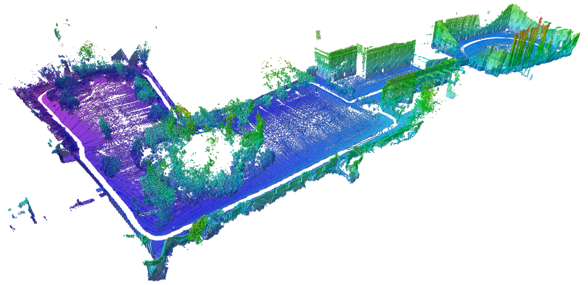

# autsys-projects-kkfly

## Assignment - Advanced Challenge 1 – Sim & Mapping
### 1. Create realistic environment (i.e. city, harbour, ... [200m x 200m]),
- create an unity environment 
### 2. process pointcloud into voxel-grid,
- create computer vision package
- create navigation/positioning package
### 3. generate a local trajectory in known space (2D) in a receeding horizon fashion,
- create trajectory planner package 
- create controller package
### 4. map the environment.
- create a mapping package

URL: https://octomap.github.io/newcol_big.png
## Milestones
	09.Jan. Literature research about the topics based on "Grid map", "Navigation/data fusion", "Trajectory planning"
	
	23.Jan. Finished Unity environment including search favorite open resource.

	27.Feb. Divide the Processes 2 and 3 to individual tasks, this is the final schedule/milestone to summarize these packages under the basic structure. And together implement the final package mapping function.

	20.Mar. Write the final IEEE report and representation.

## Members:
- Shengkai Huang 
- Yu Li
- Yu-Chen Chou
- Hung-Yueh Liao
	

	
